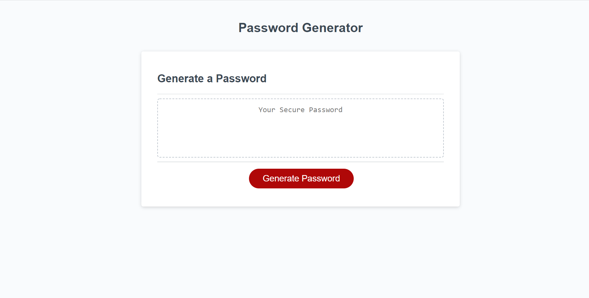

# Password-Generator
### A tool to generate a random password that includes what parameters are chosen

## Purpose
This was a very interesting project to complete. I was given the task to create a random password generator, that depending on what parameters where chosen, such as uppercase, lowercase, numbers or symbols could be included. I took many different approaches to this before I got it just right. I do believe that there could be some optimization done to it, and I did try but I couldnt quite get them to work. As I learn more I will return to this and hopefully be able to figure this out.

## Usage
This is quite simple to operate. All that you need to do is press the generate password button and then a series of prompts will pop up that are required to be filled out. They all must be filled in correctly or an alert will pop up stating that the wrong format has been inserted. Once all the options have been filled out, it generates you a password that meets the demands of what was asked.

## Additional
I learned quite a bit on this task, including how to lay things out in the correct way and how to use functions to attain my goals. There was a lot that I had to look for myself and it has taught me about different ways to go about achieving a task. It is very interesting to see that there are different ways to go about doing the same thing, and I am sure as I learn more I will be able to optimize this code.